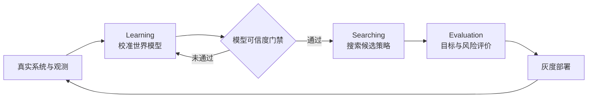

## 1. 核心结论

一类复杂系统可以抽象为两个相互衔接的过程：

- **Learning**：利用真实观测校准世界模型，使模型逐步逼近现实系统。
- **Searching**：在当前可信的世界模型中展开候选策略，寻找优化目标下的更优解。

二者通过评价与部署形成循环：

> **Learning 学习“世界如何运行”，Searching 探索“在这个世界中应该如何行动”。**

统一来看，这是一个由目标函数引导的迭代逼近过程：

```text
真实观测
    → Learning：校准世界模型
    → 验证模型可信度
    → Searching：搜索候选策略
    → Evaluation：选择更优策略
    → 部署并获得新观测
    → 下一轮 Learning
```

## 2. 系统边界：世界模型不等于仿真系统

这几个概念必须分开。

### 2.1 世界模型

世界模型描述系统的状态、参数与变化规律，回答：

> 给定当前状态、外部条件和一个动作，接下来可能发生什么？

可以写成：

$$
s_{t+1} \sim M_{\theta}(s_t, a_t, u_t, \xi_t)
$$

其中：

- \(s_t\)：系统当前状态；
- \(a_t\)：策略选择的动作；
- \(u_t\)：外部输入与约束；
- \(\xi_t\)：随机扰动和未完全观测的影响；
- \(\theta\)：需要由真实数据校准的世界模型参数。

世界模型既可以是显式规则、状态机、离散事件模型或微分方程，也可以包含统计模型和神经网络。关键不在实现形式，而在于它表达的是**系统动力学与因果约束**，不是“应该选择什么动作”。

### 2.2 仿真引擎

仿真引擎是执行世界模型的计算机制，负责：

- 推进时间；
- 调度事件；
- 应用状态转移；
- 采样随机扰动；
- 记录轨迹与结果。

世界模型是“规则与参数”，仿真引擎是“运行这些规则的机器”。

### 2.3 策略

策略 \(\pi\) 根据当前状态选择动作：

$$
a_t = \pi(s_t)
$$

策略可以是规则组合、参数配置、优化器输出、规划器，也可以是学习得到的策略网络。Searching 的目标是比较或构造候选策略，而不是修改世界事实。

### 2.4 评价器

评价器把一段仿真轨迹映射为目标值：

$$
J(\tau) = J(s_0, a_0, s_1, a_1, \ldots, s_T)
$$

目标可以是单指标，也可以是带约束的多目标函数，例如收益、时延、成本、资源使用、可靠性与风险。

### 2.5 完整仿真系统

完整仿真系统不是单独的世界模型，而是：

$$
\text{Simulator}
=
\text{Engine}
+ M_{\theta}
+ s_0
+ \pi
+ \xi
+ J
$$

即：

```text
世界模型参数 + 初始状态 + 外部输入 + 候选策略 + 随机扰动
                           ↓
                        仿真引擎
                           ↓
                       轨迹与结果
                           ↓
                         评价器
```

因此更准确的表述是：

> **Learning 校准可执行世界模型；Searching 借助完整仿真系统优化策略。**

## 3. Learning：用真实数据校准世界

### 3.1 学习对象

Learning 更新的是世界模型参数 \(\theta\)，而不是候选策略本身。

真实数据可抽象为：

$$
D_t = \{(x_i, y_i)\}_{i=1}^{n}
$$

其中：

- \(x_i\) 包含初始状态、外部条件和实际动作；
- \(y_i\) 包含真实状态转移、轨迹和最终结果。

Learning 寻找一组参数，使模型在相同输入下尽可能复现真实输出：

$$
\theta_{t+1}
=
\arg\min_{\theta}
L_{\text{reality}}
\bigl(M_{\theta}(x), y\bigr)
$$

### 3.2 学习目标

Learning 优化的是**现实拟合目标**，例如：

- 状态转移误差；
- 轨迹误差；
- 时间与资源消耗误差；
- 事件发生概率误差；
- 结果分布误差；
- 跨时间窗口的稳定性误差。

它回答的是：

> 当前模型是否足以解释真实系统？

### 3.3 可信度验证

模型不能只在参与拟合的数据上表现良好。至少要检查：

- 未参与拟合的数据能否被复现；
- 不同时间窗口下误差是否稳定；
- 关键事件和尾部风险是否被覆盖；
- 参数是否可识别，还是多组参数都能碰巧拟合同一结果；
- 模型误差是否低于策略比较所需的分辨率。

最后一项尤其重要：如果两个候选策略的预期差距只有 2%，而模型误差达到 10%，仿真就没有能力可靠区分它们。

### 3.4 数据纪律

世界模型必须由真实观测锚定。不能用模型自己生成的数据证明模型正确，否则会形成自证循环：

```text
有偏差的模型
    → 生成有偏差的模拟数据
    → 用模拟数据继续校准模型
    → 偏差被固化和放大
```

模拟数据可以用于压力测试、覆盖稀有分支或训练策略，但不能替代真实数据对世界模型的校准。

## 4. Searching：在可信世界中优化策略

### 4.1 搜索对象

当世界模型达到预设可信度后，固定当前参数快照 \(\theta_{t+1}\)，在策略空间 \(\Pi\) 中搜索：

$$
\pi_t^*
=
\arg\max_{\pi \in \Pi}
\mathbb{E}
\left[
J\bigl(\operatorname{Sim}(M_{\theta_{t+1}}, \pi, \xi)\bigr)
\right]
$$

Searching 优化的是**任务或控制目标**，而不是现实拟合误差。

### 4.2 搜索方法

候选策略可以通过多种方式产生与筛选：

- 枚举和网格搜索；
- 组合优化；
- 动态规划；
- 树搜索；
- 贝叶斯优化；
- 进化算法；
- 梯度优化；
- 强化学习；
- 生成模型提出候选，再由仿真验证。

这套方法论不绑定某一种搜索算法。算法选择取决于策略空间是否离散、能否求导、仿真成本、约束复杂度和风险容忍度。

### 4.3 鲁棒搜索

只在单一参数快照上取得高分，可能导致策略过拟合模型。更稳妥的搜索应考虑：

- 参数不确定性；
- 多种初始状态；
- 随机扰动；
- 分布漂移；
- 极端但合理的边界条件。

因此优化目标可扩展为：

$$
\pi^*
=
\arg\max_{\pi}
\left(
\mathbb{E}[J]
- \lambda\,\operatorname{Risk}(J)
\right)
$$

即不仅追求平均表现，也惩罚方差、尾部损失或违反硬约束的风险。

### 4.4 Search 结果不一定需要再训练

搜索得到的最优策略可以直接是一组规则、参数或计划，并不天然要求训练策略网络。

只有在以下情况下，才值得把搜索结果进一步蒸馏或学习为策略模型：

- 在线搜索太慢；
- 需要毫秒级决策；
- 状态空间过大，无法保存搜索结果；
- 希望把多轮搜索经验压缩为可泛化的快速决策器。

因此，“策略搜索”和“策略学习”是两个可组合但不等价的步骤。

## 5. Evaluation：两套目标函数

整个闭环至少有两套彼此独立的评价：

| 过程 | 核心问题 | 目标函数 |
|---|---|---|
| Learning | 模型是否足够像现实？ | 最小化现实拟合误差 \(L_{\text{reality}}\) |
| Searching | 哪个策略的结果更好？ | 最大化目标效用 \(J\) |

这两个目标不能混为一谈：

- 拟合准确的模型不自动产生优秀策略；
- 在错误模型中取得高分的策略也不代表现实中有效。

一个可靠系统必须先证明模型具有足够的策略区分能力，再相信搜索结果。

## 6. Deploy：闭合现实反馈

仿真中的最优策略只是候选结论。它需要经过现实验证：

1. 约束检查与人工审查；
2. 离线回放；
3. shadow 模式；
4. 小流量或灰度运行；
5. 监控目标指标与安全指标；
6. 满足退出条件后扩大范围，否则回滚。

部署后得到新的真实数据：

$$
D_{t+1} = \operatorname{Reality}(\pi_t^*)
$$

这些数据同时用于：

- 验证策略收益是否符合模拟预测；
- 发现世界模型尚未解释的差异；
- 更新下一轮模型参数。

完整闭环为：

$$
D_t
\xrightarrow{\text{Learning}}
\theta_{t+1}
\xrightarrow{\text{Searching}}
\pi_t^*
\xrightarrow{\text{Deploy}}
D_{t+1}
$$



## 7. 与 AlphaGo 的方法论对比

### 7.1 AlphaGo 的简化循环

以 AlphaGo Zero 式抽象为例：

1. Policy / Value 网络给出动作先验和局面价值。
2. MCTS 展开未来动作，得到比当前网络直觉更强的搜索结果。
3. 自我对弈产生状态、搜索分布和最终胜负。
4. Learning 用搜索分布训练 Policy，用胜负训练 Value。
5. 更强的网络继续指导下一轮 MCTS。

```text
当前 Policy / Value
    → MCTS Searching
    → 自我对弈与胜负评价
    → Learning 更新 Policy / Value
    → 更强的 Policy / Value
```

其关键机制是：

> **Search 是慢而强的老师，Learning 把搜索能力压缩为快速、可复用的 Policy / Value。**

### 7.2 共同结构

两者都遵循：

```text
当前模型
    → Searching：扩展候选
    → Evaluation：施加选择压力
    → Learning：吸收可验证的信息
    → 更新模型
    → 下一轮
```

共同本质是：

> **Goal 提供方向，Searching 扩展可能性，Evaluation 产生选择压力，Learning 沉淀可复用信息，循环持续逼近目标。**

### 7.3 关键差异

| 维度 | AlphaGo | 现实系统优化闭环 |
|---|---|---|
| 世界 | 规则固定、完整且可精确模拟 | 动力学未知、变化且只能近似 |
| Searching | 搜索更优动作 | 在仿真中搜索更优策略 |
| Learning | 更新 Policy / Value | 用真实数据校准世界模型 |
| 学习数据 | 自我对弈数据 | 真实系统观测 |
| 评价 | 搜索分布与最终胜负 | 模型误差与目标效用两套评价 |
| Search 结果 | 继续教回网络 | 可直接形成部署策略，也可选做策略学习 |
| 最大风险 | 搜索预算不足 | 模型偏差导致“模拟最优、现实失效” |

AlphaGo 的环境规则天然准确，因此可以让搜索与学习在模拟世界中闭合。现实系统没有这个前提：

> **现实负责教世界模型；世界模型支撑仿真；仿真帮助搜索策略；部署结果再交由现实检验。**

## 8. 常见失败模式

### 8.1 把模型和引擎混为一谈

结果是模型参数、执行逻辑、策略和评价指标互相污染，无法独立校准、替换和测试。

### 8.2 把策略写进世界事实

这样会失去反事实能力：系统无法区分“世界本来如此”和“因为选择了某个策略才如此”。

### 8.3 模型未验证就大规模搜索

优化器通常擅长发现模型漏洞。搜索越强，越可能得到利用模拟偏差的脆弱策略。

### 8.4 用同一批数据拟合并验收

这只能证明模型记住了历史，不能证明它能解释未见数据或支持策略比较。

### 8.5 只优化平均值

平均收益提高可能掩盖尾部风险、硬约束违反或少数严重失败。

### 8.6 把 Search 等同于 Learning

Search 产生候选并比较结果；Learning 更新可复用模型。二者可以互相提供数据，但职责不同。

## 9. 最小可验证实现

一个最小闭环可以按以下顺序搭建：

1. 定义状态、动作、外部输入和结果数据结构。
2. 建立可执行世界模型与参数快照机制。
3. 准备真实轨迹，并划分拟合集与验证集。
4. 定义现实拟合损失 \(L_{\text{reality}}\)。
5. 校准模型，并设置可信度门禁。
6. 定义候选策略空间、目标函数和硬约束。
7. 在多个初始状态和扰动下搜索策略。
8. 输出候选策略的均值、方差、尾部风险和约束违反情况。
9. 对最优候选进行 shadow 或灰度验证。
10. 比较真实结果与模拟预测，并将新观测送入下一轮 Learning。

最低成功标准不是“模拟中找到高分策略”，而是同时满足：

- 世界模型在未参与拟合的真实数据上具有可接受误差；
- 模型误差小于需要识别的策略收益差距；
- 搜索结果对参数扰动和边界条件具有鲁棒性；
- 部署后的真实变化与模拟预测方向一致；
- 新观测能够推动下一轮校准，而不是依赖人工重新解释全部结果。

## 10. 最终表述

> **这是一个目标驱动的 Learning–Searching 闭环：Learning 由真实观测驱动，持续校准可执行世界模型，使其逼近现实系统；Searching 固定当前可信的模型快照，借助仿真系统展开并评价候选策略，选择更优策略进行受控部署。部署产生的新观测进入下一轮 Learning。其高层结构与 AlphaGo 同为 Searching–Evaluation–Learning 的循环逼近，但 AlphaGo 主要学习 Policy / Value，现实系统闭环主要学习世界模型。**
